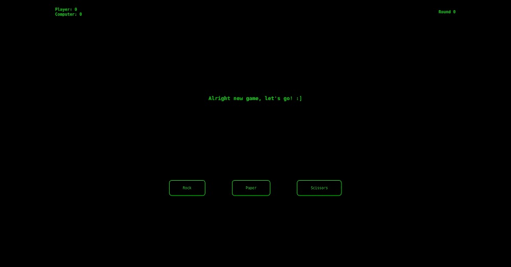

# Odin_RockPaperScissors
Hey! This is my repository for the project [Rock Paper Scissors](https://www.theodinproject.com/lessons/foundations-rock-paper-scissors) a.k.a RPS.

## How to Play
Clicking any of the choices (rock, paper, or scissors) will start one round of RPS. The result of each round is shown on screen based on the computer's reply (see reference below).
|  | Computer Win | Computer Lose | Tie |
|--|--|--|--|
| Replies| ":], Heh!, Ez round win" | "You just got lucky this round" | "It's a tie this round :_)" |
| | "Beat that human, let's go new round!" | "Alright I lost this round." | "Nobody won this round." |
| | "Thanks for the round win :]" | "It's not yet over. New round please!" | "New round please!" |

Whoever gets to five points, as indicated by the scoreboard on the top left, wins the game.

## Notes
I had a design for this one, but I just felt the need to move forward with the project. So, I made the design simple. Just green text with a dark background, like those hacker movie things. I hope you will enjoy it as much as I did!